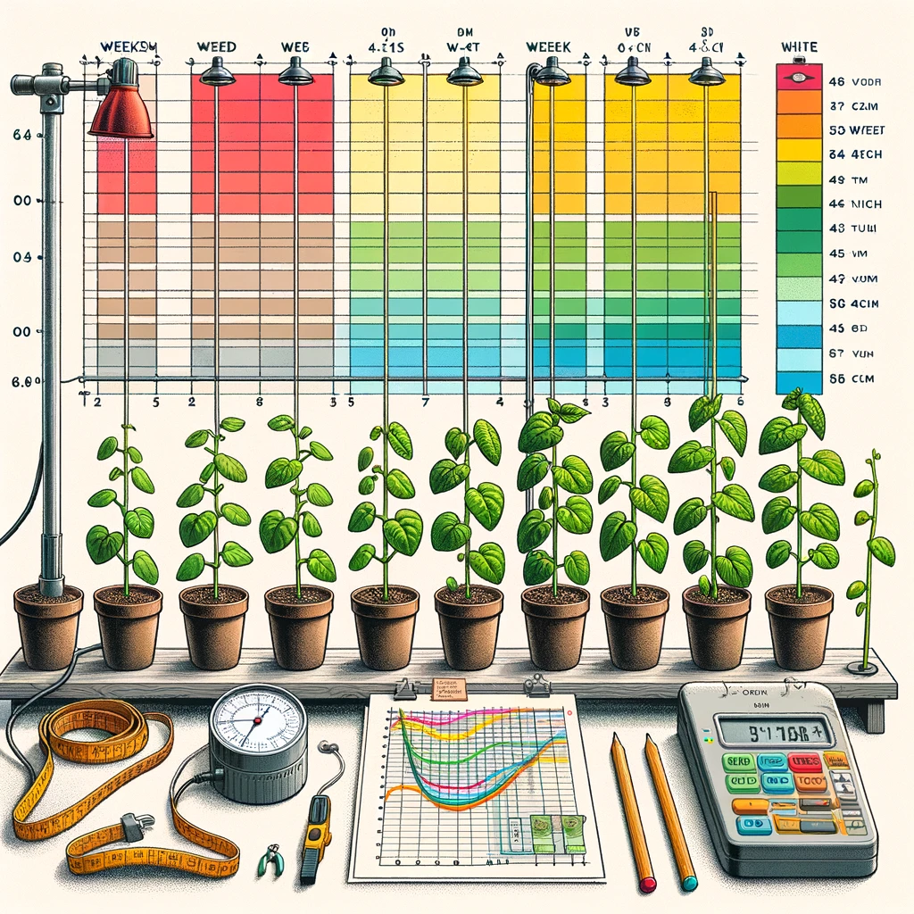
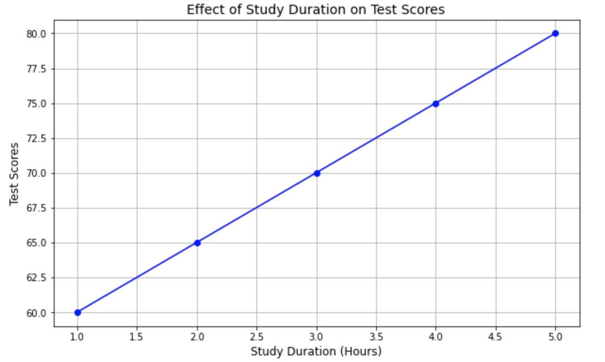
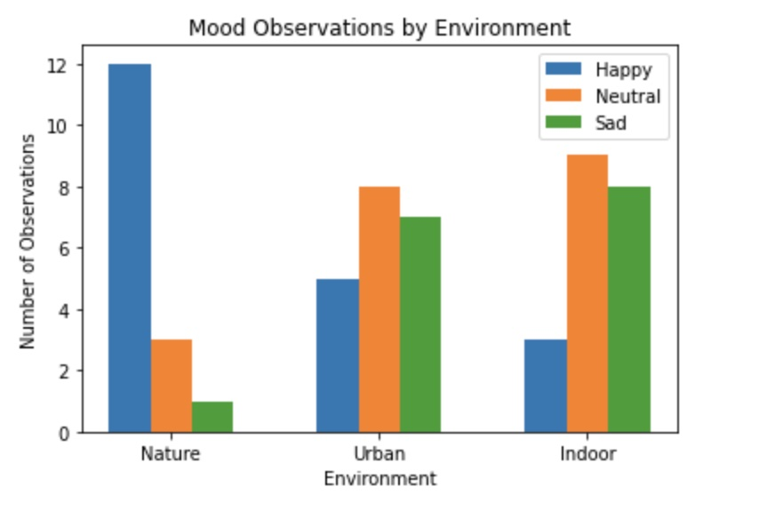

# Designing the Experiment

When you're ready to design your experiment, remember, the goal is to find out if your hypothesis is correct. Here's how you can start:

**Identify Your Variables:**
   - **Independent Variable:** What you will change. This should be one thing to ensure a fair test.
   - **Dependent Variable:** What you will measure or observe to see if there's an effect from the change you made.
   - **Controlled Variables:** These are everything else in the experiment that must stay the same to ensure that any changes to the dependent variable are due to your independent variable only.

**List Your Materials:**
   - Be specific. Instead of saying "container," specify the type, like a "500ml plastic beaker."
   - Quantify everything. If you're using water, how much? If you're using light, what intensity?

**Draft Your Procedure:**
   - Make it step-by-step so someone else could repeat your experiment exactly.
   - Include details on how you'll change your independent variable and how you'll measure your dependent variable.
   - Don't forget to mention how often you'll take measurements and how long the experiment will run.

**Points to remember**

When you're setting up and documenting your experiment, be sure to provide detailed and clear information. This ensures that someone else could accurately replicate your experiment based solely on your description. Here's how to ensure your experiment's materials and procedure meet these standards:

### Materials:
- **List Format:** Start by listing all the materials you'll use in your experiment. This list should be clear and separate from your procedure to avoid confusion.
- **Quantification:** For each material, specify the amount you'll use in the experiment. This detail is crucial for replication. For example, instead of "water," say "500ml of water."
- **Relevance:** Only include materials you actually use. If something was available but not used, don't list it. This keeps your materials list concise and focused.

### Procedure and Set-Up Diagrams:
- **Numbered List:** Write each step of your procedure as a separate item in a numbered list. This format makes the procedure easy to follow.
- **Logical Sequence:** Ensure that the steps are ordered logically. Each action should flow into the next, guiding anyone trying to replicate your experiment through the process smoothly.
- **Detail and Clarity:** Your procedure should be detailed enough for someone else to replicate the experiment without guessing any steps. Avoid assuming knowledge that isn't explicitly stated.
- **Repeated Trials:** Mention if and how you conduct repeated trials. This might include repeating a measurement multiple times to ensure accuracy. Be clear that repeats are at the same condition level, not across different conditions.
- **Diagrams:** Include diagrams or sketches that illustrate your experimental setup. These visuals are invaluable for providing clarity and enhancing understanding. Make sure each diagram is labeled, including titles and key components.
- **Data Collection:** Explain what data you'll collect, both quantitative (numbers) and qualitative (descriptions), and how you plan to collect it. This includes specifying the method for determining and measuring outcomes related to your experiment’s purpose.

By adhering to these guidelines, you ensure that your experimental design is not only rigorous but also accessible to others in the scientific community. This practice is fundamental in science, allowing for the verification and replication of results, which are cornerstones of scientific progress.

#### Examples

**Testing Plant Growth Under Different Music Genres**
---

**Objective:** To see if playing different genres of music to plants affects their growth rate.

**Materials:**
- 10 plants, unspecified types and sizes
- 4 music players, each set to a different genre (classical, rock, jazz, silence as control)
- Measuring tool, not specified

**Procedure:**
1. **Setup:** Place all plants in the same room but don't specify distances from the music source or each other.
2. **Music Exposure:** Play different music genres to each plant group for varying hours per day, not standardized.
3. **Growth Measurement:** Measure plant growth "when remembered," without a set schedule, using any available measuring tool.
4. **Watering and Care:** Water plants "as needed," without specifying quantity or frequency.

  
Critique

- **Lack of Specificity:** The experiment lacks detailed planning, such as specifying plant types, ensuring they are of similar size and health, or standardizing the distance from the music source.
- **Inconsistent Treatment:** Music exposure times vary, and there's no control over environmental factors like light, temperature, or soil type, which could influence growth.
- **Irregular Measurements:** The lack of a regular schedule for measuring plant growth introduces variability and reduces the reliability of the data collected.
- **Variable Watering and Care:** The "as needed" approach to watering doesn't ensure that all plants receive equal care, introducing another variable that could affect growth.

**The Effect of Light on Plant Growth**
---

**Objective:** To determine the effect of different light colors on the growth rate of bean plants.

**Materials:**
- 30 bean plants of similar size and age
- 5 grow lights (red, blue, green, yellow, white)
- Timer for light regulation
- Measuring tape
- Growth chart for recording height
- Standard potting soil
- Identical pots

**Procedure:**
1. **Setup:** Plant bean plants in identical pots with standard potting soil. Ensure all plants are of similar size and health.
2. **Light Exposure:** Assign each group of 6 plants to a different light color, including one group under natural light as a control. Use the timer to ensure all plants receive light for the same duration daily (12 hours).
3. **Measurement:** Measure the initial height of each plant. Record these as your baseline measurements.
4. **Daily Care:** Water the plants equally, ensuring the soil moisture is consistent across all groups.
5. **Growth Tracking:** Measure and record the height of each plant weekly for 6 weeks. Use the growth chart for documentation.
6. **Data Analysis:** At the end of the experiment, compare the growth rate of plants under different light colors to those grown under natural light.

  
Critique

  This is a good experiment! It controls for variables like pot size, soil type, and watering schedule, focusing solely on the light's color effect.
  

# Data Collection: Gathering and Organizing Your Findings

- **Quantitative Data:** This is numerical data, like how tall a plant grows in centimeters. Use tools like rulers or scales to collect precise measurements.
- **Qualitative Data:** This describes qualities, like the health of a plant based on leaf color. Take notes or photos to record these observations.
- **Organizing Data:** Use tables to keep track of your data. Charts and graphs can help visualize the relationship between your independent and dependent variables.

## Strategies and Organizing

**Gathering Data:**
- **Qualitative Data:** These are descriptive data and can include observations about behaviors, physical characteristics, or responses not easily quantified. For example, noting how plants react to different music genres could involve descriptions of leaf color or plant demeanor.
- **Quantitative Data:** Numerical data that can be measured. For example, counting the number of leaves on a plant or measuring its height in centimeters.

**Organizing Data:**
- **Tables for Quantitative Data:** Create a table with clear column headings for each variable, including units of measurement. Each row should represent a different measurement or observation period.
- **Qualitative Data Recording:** Keep a detailed log or journal of observations, noting any changes, unexpected results, or deviations from the procedure.

**Charts and Graphs:**
- **Quantitative Data:** Use scatter plots to show relationships between two quantitative variables. For data over time or categories, line graphs and bar charts are effective. Ensure each axis is labeled with the variable name and unit.
- **Qualitative Data:** Bar charts can summarize categorical data, like the number of plants showing a specific reaction to stimuli.

**Important points:**
- Ensure qualitative observations detail what worked, what didn’t, and any unexpected findings.
- Quantitative data must be in properly labeled tables, including units.
- Choose the appropriate graph type based on the data: use line graphs/scatter plots for quantitative independent variables and bar graphs for qualitative independent variables.
- Label all parts of graphs correctly, including titles, axes, and units, to ensure clarity and facilitate understanding.

### Example: Quantitative Data ###

Suppose you have data from an experiment on the effect of study duration on test scores. Your independent variable would be the study duration in hours, and your dependent variable would be the test scores.

1. **Collect the Data:**
   - You would generally collect your data into a table, such as the following:

| Study Duration (Hours) | Test Scores |
|------------------------|-------------|
| 1                      | 60          |
| 2                      | 65          |
| 3                      | 70          |
| 4                      | 75          |
| 5                      | 80          |
   

2. **Plotting the Data:**
   - You would typically use a scatter plot or line graph for this type of data. Each point on the graph represents a data pair of study duration and the corresponding test score.

   

When plotting the data, make sure to annotate the axes and plot in the following manner.
   - Title: "Effect of Study Duration on Test Scores"
   - X-axis label: "Study Duration (Hours)" (Independent Variable)
   - Y-axis label: "Test Scores" (Dependent Variable)
   - You might also include a legend if you have multiple datasets or lines on the same graph, and a grid to make the data points easier to interpret.

By plotting the data in this manner, you visually represent the relationship between study duration and test scores, making it easier to see trends, patterns, or outliers in your data.

### Example: Qualitative Data ###

Consider an experiment where we're observing the effect of different environments on the mood of a group of people. The environments are "Nature," "Urban," and "Indoor." The qualitative data could be the observed mood states: "Happy," "Neutral," and "Sad."

1: **Collect the Data:**

Over a week, you observe people in different environments and note their mood states. Your notes might look like this:

- Nature: 12 observations of "Happy," 3 of "Neutral," 1 of "Sad"
- Urban: 5 observations of "Happy," 8 of "Neutral," 7 of "Sad"
- Indoor: 3 observations of "Happy," 9 of "Neutral," 8 of "Sad"

2. **Plotting the Data:**

To visualize this data, you decide to create a bar chart that shows the mood distribution across the three environments.

   

